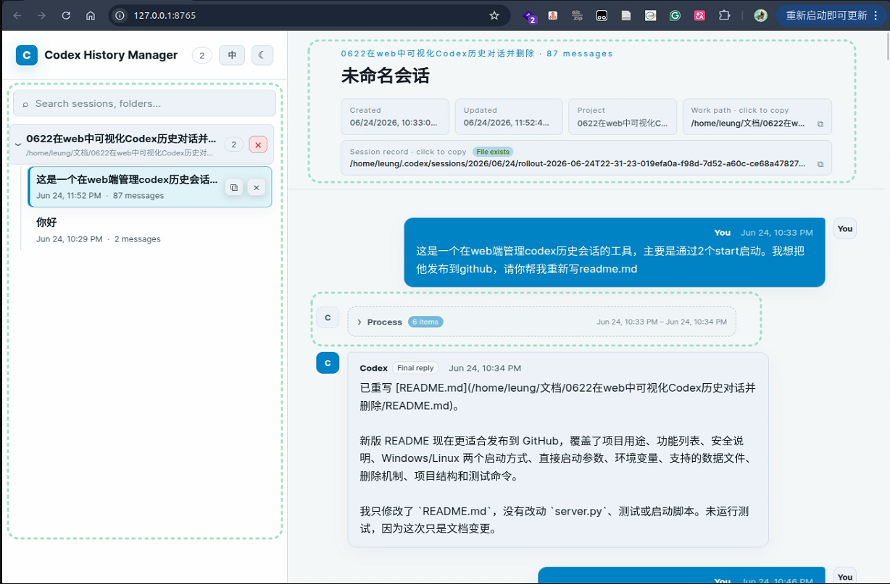
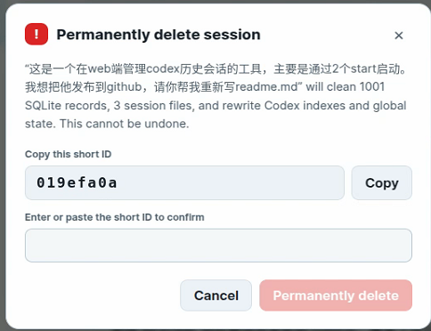

# Codex History Manager

[中文](README.md) | English

A local web manager for Codex conversation history. It starts a small web service on your machine, then lets you search, inspect, group, and delete Codex sessions from the browser instead of digging through the `.codex` directory by hand.

It lists project groups, temporary sessions, archived sessions, linked projects, session cache paths, creation time, update time, and message counts. Before deletion, it generates a cleanup plan and requires a second confirmation to reduce accidental deletes.

The project uses only the Python standard library and native frontend code. No extra dependencies are required.

## Screenshots

Session list and grouped view:



Second confirmation before deletion:



## Features

- View local Codex conversation history in the browser
- Group sessions by project directory, with temporary and archived sessions separated
- Search by session title, working directory, and first user message
- Inspect linked project, session file path, creation time, update time, and message count
- View user messages, Codex progress, final answers, and legacy assistant replies
- Copy working directory paths and session record paths
- Switch between dark and light themes
- Delete a single session or a whole group
- Generate a deletion plan and require confirmation before deleting

## Requirements

- Python 3.10+
- Conda, if you use the startup scripts
- Windows, Linux, or Ubuntu

You can also run `server.py` directly with a system Python interpreter.

## Quick Start

### Windows

Double-click:

```text
start_windows.bat
```

The script calls `start_windows.ps1`, lists available conda environments, and starts the service after you choose one. The terminal prints the final URL, for example:

```text
Codex History Manager: http://127.0.0.1:8765
```

Keep the terminal window open while using the browser page.

### Linux / Ubuntu

Allow execution once:

```bash
chmod +x start_linux.sh
```

Start:

```bash
./start_linux.sh
```

The script lists conda environments and starts the local web service with the selected environment.

## Run Directly

Without the startup scripts:

```bash
python server.py
```

Defaults:

- Host: `127.0.0.1`
- Port: `8765`
- Codex home: `CODEX_HOME`, or `~/.codex` when unset

Custom arguments:

```bash
python server.py --host 127.0.0.1 --port 9000 --codex-home /path/to/.codex
```

PowerShell example:

```powershell
python server.py --host 127.0.0.1 --port 9000 --codex-home "$env:USERPROFILE\.codex"
```

If the default port is unavailable, the program automatically chooses an available port and prints the final URL.

## Environment Variables

Linux / Ubuntu:

```bash
CODEX_HOME="$HOME/.codex" HOST=127.0.0.1 PORT=8765 ./start_linux.sh
```

Windows PowerShell:

```powershell
$env:CODEX_HOME="$env:USERPROFILE\.codex"
$env:HOST="127.0.0.1"
$env:PORT="8765"
.\start_windows.ps1
```

## Supported Codex Data

The current implementation reads and cleans these local Codex files:

- `sessions/**/*.jsonl`
- `session_index.jsonl`
- `state_5.sqlite`
- `logs_2.sqlite`
- `goals_1.sqlite`
- `.codex-global-state.json`
- `.codex-global-state.json.bak`
- `shell_snapshots/`
- `archived_sessions/`

If a future Codex release changes the local data structure, deletion may be refused with an explanation in the UI.

## Correct Ways to Delete Codex Sessions

Prefer the deletion flow built into the Codex client you used. This tool is a visual local manager and supplemental cleanup tool, useful when you want to browse, verify paths, or organize multiple local sessions in one place.

- **Codex CLI**: use `/delete` in the current session to delete it and exit, or run `codex delete` in a terminal to delete a saved session by ID or name. Use `/archive` or `codex archive` when you only want to hide a transcript from active lists.
- **Windows Desktop / Codex app**: archive the thread first, then delete it from archived threads. Removing a project does not delete its history; a thread may remain even after a project directory or worktree is removed.
- **PyCharm / JetBrains Codex plugin**: prefer deleting from the plugin's own session list, such as right-clicking the session name. Treat these IDE sessions as managed by the plugin rather than assuming they are removed from external CLI or desktop history.
- **VS Code Codex sessions**: if the extension does not provide an explicit delete action, use the external Codex CLI, for example `/delete` for the current session or `codex delete <SESSION_ID>` for a specific saved session.

## Deletion Flow

For a single session, the tool first generates a deletion plan showing the expected number of SQLite rows and files to clean. You must enter the session short ID before deletion runs.

For a whole group, the confirmation text is:

```text
purge-selected
```

Backend safeguards include:

- Validate session ID format
- Ensure the session record path is inside the Codex sessions directory
- Refuse to delete the currently running Codex session
- Check whether the session file is still growing
- Validate JSON storage files before rewriting them
- Scan for remaining references after deletion

## Safety Notes

By default, the service listens only on `127.0.0.1`, so it is intended for local use on your own machine. It does not upload Codex history and does not depend on any remote service.

Deletion modifies local Codex data, including session `jsonl` files, `state_5.sqlite`, `logs_2.sqlite`, `goals_1.sqlite`, `session_index.jsonl`, global state files, and related shell snapshots. Deletion is irreversible. Back up your `.codex` directory before using deletion for the first time.

Deleting a session does not delete your project directory or any source files inside it.

## Project Structure

```text
.
├── server.py              # Local HTTP service, session parser, deletion logic
├── static/
│   ├── index.html         # Web page
│   ├── app.js             # Frontend interactions
│   └── style.css          # Page styles
├── start_linux.sh         # Linux / Ubuntu startup script
├── start_windows.bat      # Windows double-click entry
├── start_windows.ps1      # Windows PowerShell startup script
└── tests/
    └── test_server.py     # Backend unit tests
```

## Tests

```bash
python -m unittest discover -s tests -v
```

## License

[MIT](LICENSE)

## Credits

Thanks to [liuyoumi/codex-history](https://github.com/liuyoumi/codex-history). The complete deletion strategy and risk checks in this project were inspired by its deletion logic.

All code, documentation, and release notes for this project were generated by Codex, then locally tested and manually reviewed before release.
