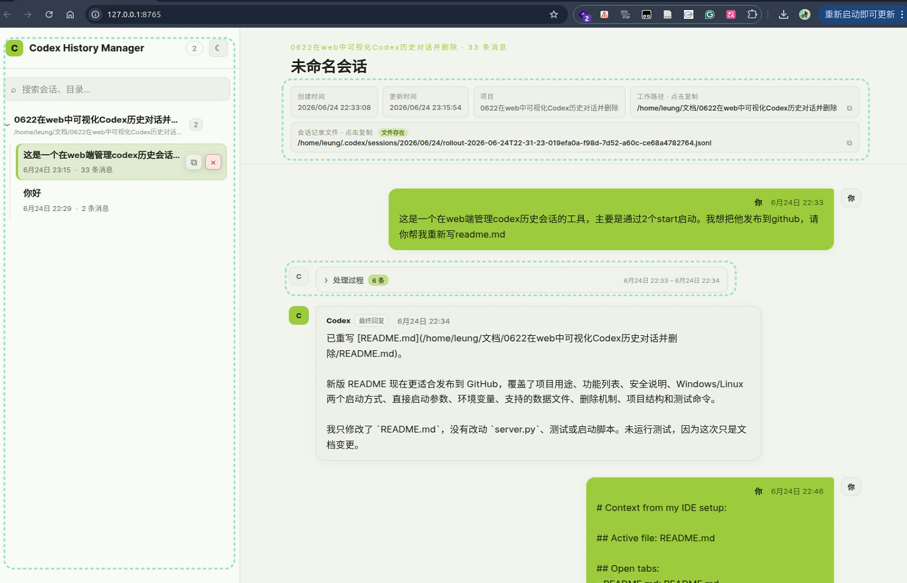
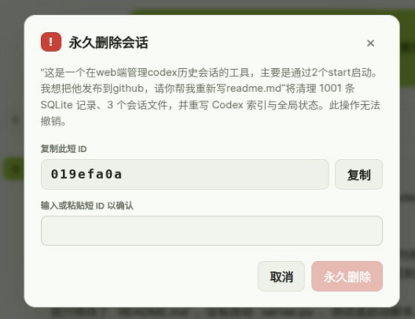

# Codex History Manager

中文 | [English](README.en.md)

一个本地运行的 Codex 历史会话 Web 管理工具。启动后会在本机开启一个 Web 服务，你可以直接在浏览器里搜索、查看、分组和删除 Codex 历史会话，操作路径比手动翻 `.codex` 目录更清晰。

它会详细列出每个会话，包括项目分组、临时会话、关联项目、会话缓存地址、创建时间、更新时间和消息数量。删除会话时会先生成清理计划，并要求二次确认，尽量避免手抖误删。

项目只使用 Python 标准库和原生前端，不需要安装额外依赖。

## 界面预览

会话列表和分组视图：



删除前的二次确认：



## 功能

- 在浏览器中查看本机 Codex 历史会话
- 按项目目录自动分组，临时会话单独归类
- 搜索会话标题、工作目录和首条用户消息
- 查看关联项目、会话文件路径、创建时间、更新时间和消息数量
- 展示用户消息、Codex 处理过程、最终回复和旧版回复
- 复制工作目录路径和会话记录文件路径
- 深色 / 浅色主题切换
- 删除单个会话或整个分组的会话
- 删除前生成清理计划，并要求输入确认码

## 安全说明

这个工具默认只监听 `127.0.0.1`，适合在自己的电脑上本地使用。它不会主动上传 Codex 历史数据，也不依赖任何远程服务。

删除功能会修改 Codex 的本地数据文件，包括会话 `jsonl`、`state_5.sqlite`、`logs_2.sqlite`、`goals_1.sqlite`、`session_index.jsonl`、全局状态文件和相关 shell snapshot。删除操作不可撤销，建议在首次使用删除功能前备份 `.codex` 目录。

删除会话不会删除你的项目目录，也不会删除项目里的代码文件。

## 正确删除 Codex 会话

不同 Codex 客户端的会话来源和删除入口不完全相同。优先使用客户端自带的删除方式；本工具更适合作为本地历史的可视化管理和补充清理工具。

- **Codex CLI**：在当前会话中可使用 `/delete` 删除当前会话并退出；也可以在终端使用 `codex delete` 按会话 ID 或名称删除历史会话。只想隐藏而不删除 transcript 时，使用 `/archive` 或 `codex archive`。
- **Windows Desktop / Codex app**：先在桌面端归档，再从归档会话中删除。只移除项目不会删除历史会话；项目目录或 worktree 被移除后，线程仍可能保留在历史中。
- **PyCharm / JetBrains 插件中的 Codex**：优先在插件自己的会话列表中右键会话名称删除。这类 IDE 内会话应按插件入口管理，不要假定它会同步删除外部 CLI 或桌面端历史。
- **VS Code 中的 Codex 会话**：如果扩展内没有明确删除入口，使用外部 Codex CLI 删除对应会话，例如 `/delete` 当前会话，或通过 `codex delete <SESSION_ID>` 删除指定历史会话。

## 运行环境

- Python 3.10+
- Conda（启动脚本会让你选择一个 conda 环境）
- Windows、Linux / Ubuntu

如果不想使用启动脚本，也可以直接用系统 Python 运行 `server.py`。

## 快速启动

### Windows

双击运行：

```text
start_windows.bat
```

脚本会调用 `start_windows.ps1`，列出当前机器上的 conda 环境。选择一个环境后，服务会启动并在终端打印访问地址，例如：

```text
Codex History Manager: http://127.0.0.1:8765
```

保持终端窗口打开，然后用浏览器访问该地址。

### Linux / Ubuntu

第一次运行前给脚本执行权限：

```bash
chmod +x start_linux.sh
```

启动：

```bash
./start_linux.sh
```

脚本同样会列出 conda 环境，选择后启动本地 Web 服务。

## 直接启动

不使用脚本时，可以直接运行：

```bash
python server.py
```

默认参数：

- 监听地址：`127.0.0.1`
- 端口：`8765`
- Codex 数据目录：环境变量 `CODEX_HOME`，未设置时为 `~/.codex`

指定参数：

```bash
python server.py --host 127.0.0.1 --port 9000 --codex-home /path/to/.codex
```

在 Windows PowerShell 中示例：

```powershell
python server.py --host 127.0.0.1 --port 9000 --codex-home "$env:USERPROFILE\.codex"
```

如果默认端口不可用，程序会自动选择一个可用端口，并在终端打印最终访问地址。

## 环境变量

启动脚本支持通过环境变量覆盖默认配置。

Linux / Ubuntu：

```bash
CODEX_HOME="$HOME/.codex" HOST=127.0.0.1 PORT=8765 ./start_linux.sh
```

Windows PowerShell：

```powershell
$env:CODEX_HOME="$env:USERPROFILE\.codex"
$env:HOST="127.0.0.1"
$env:PORT="8765"
.\start_windows.ps1
```

## 支持的 Codex 数据

当前实现主要读取和清理以下 Codex 本地数据：

- `sessions/**/*.jsonl`
- `session_index.jsonl`
- `state_5.sqlite`
- `logs_2.sqlite`
- `goals_1.sqlite`
- `.codex-global-state.json`
- `.codex-global-state.json.bak`
- `shell_snapshots/`

如果未来 Codex 修改本地数据结构，删除功能可能会拒绝执行，并在页面上显示原因。

## 删除机制

删除单个会话时，工具会先生成删除计划，显示预计清理的 SQLite 记录数量和文件数量。用户必须输入该会话的短 ID，才会执行删除。

删除整个分组时，工具会要求输入固定确认文本：

```text
purge-selected
```

后端会做以下保护：

- 校验会话 ID 格式
- 确认会话记录路径位于 Codex 会话目录内
- 拒绝删除当前正在运行的 Codex 会话
- 检查会话文件是否仍在增长
- 校验 JSON 存储文件可解析
- 删除后再次扫描残留引用

## 项目结构

```text
.
├── server.py              # 本地 HTTP 服务、会话解析、删除逻辑
├── static/
│   ├── index.html         # Web 页面
│   ├── app.js             # 前端交互
│   └── style.css          # 页面样式
├── start_linux.sh         # Linux / Ubuntu 启动脚本
├── start_windows.bat      # Windows 双击启动入口
├── start_windows.ps1      # Windows PowerShell 启动脚本
└── tests/
    └── test_server.py     # 后端单元测试
```

## 运行测试

```bash
python -m unittest discover -s tests -v
```

## 鸣谢

感谢 [liuyoumi/codex-history](https://github.com/liuyoumi/codex-history)。本项目的完整删除思路和风险识别参考了该项目的删除逻辑。

本项目的代码、文档和发布说明均由 Codex 生成，并在本地测试与人工审阅后整理发布。

